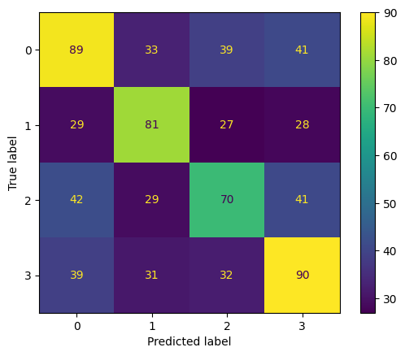
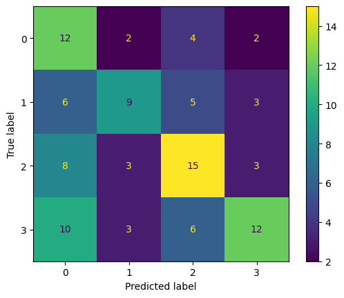
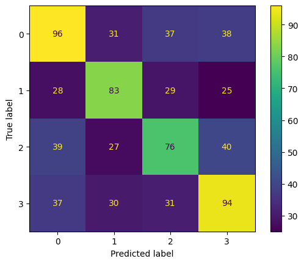
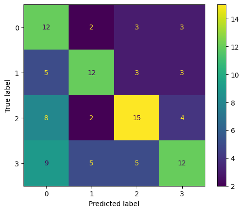
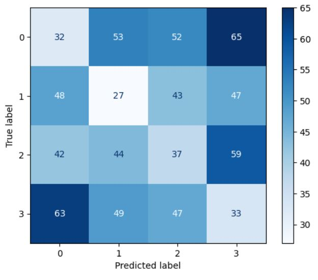
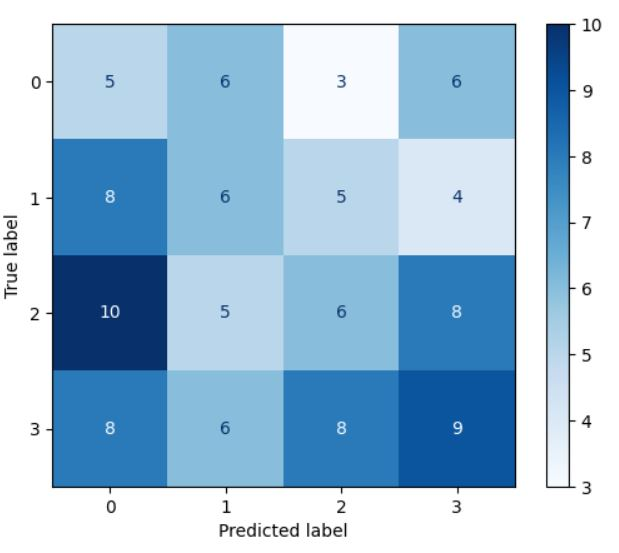
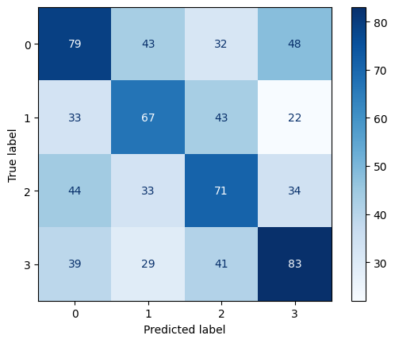
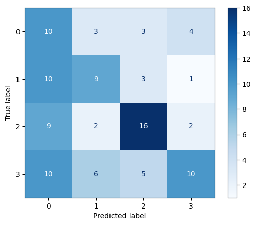

# Introduction

In recent years, the rapid development of natural language processing (NLP) technology has brought revolutionary progress to the field of text understanding and generation. So for the text comprehension part, the most basic evaluation criterion is to measure whether the model can answer some simple text questions. To evaluate the selection, fill in the blank, and question and answer questions in daily tests, we will use the relatively simplest multiple-choice questions as an attempt at NLP practice.

In this report, I will delve into how to handle a one choice four question. The report will attempt to explore text processing techniques from simple to complex, from basic to in-depth understanding of the principles of text processing, to see if high success rates can be achieved in these seemingly simple but actually challenging problems. Through practical operation and analysis, the report aims to better understand how to enable machines to understand and answer questions, while also laying the foundation for more complex text processing tasks that may be encountered in the future.

<div style="page-break-after: always;"></div>

# 1. **Dataset and Pre-Processing**

## 1.1 Dataset

Firstly, we have datasets "train. json", "val. json", and "test. json", which are used as training, validation, and testing sets respectively. The format of these three datasets is consistent, each containing the problem and its four options, as well as an index of one correct option. The format is as follows

```json
[
  {
    "question": "how are glacier caves formed?",
    "options": [
      "The ice facade is approximately 60 m high",
      "A partly submerged glacier cave on Perito Moreno Glacier .",
      "Ice formations in the Titlis glacier cave",
      "A glacier cave is a cave formed within the ice of a glacier ."
    ],
    "correct_index": 3
  }... //other elements
]
```

## 1.2 Basic Coding

According to the function "text_pipeline_spacy_special" in Lab 3, now we can transfer the json files into tokens. 

```python
def text_pipeline_spacy_special(text):
  tokens = []
  doc = nlp(text)
  for t in doc:
    if not t.is_punct and not t.is_space: // if possible t.is_stop can be added
      tokens.append(t.text.lower()) 
  return tokens
```

Therefore, we can answer some basic information required by the question from the data, which will be elaborated on it based on the index. After a simple word segmentation, we first need to collect relevant information, such as average token length, total vocabulary, and so on. Understanding this information can help us better clean the data and process it into a form that is easy to learn.

Taking the training set as an example, we can first perform word segmentation on each option and problem

```python
def preprocessing_dataset(train_data):
  processed_train_data = []
  for item in train_data:
    processed_question = text_pipeline_spacy_special(item['question'])
    processed_options = [text_pipeline_spacy_special(option) for option in item['options']]
    correct_option_index = item['correct_index']
    processed_item = {
        'question': processed_question,
        'options': processed_options,
        'correct_index': correct_option_index
    }
    processed_train_data.append(processed_item)
  return processed_train_data

processed_train_data = preprocessing_dataset(train_data)

average_tokens_per_question = sum(len(item['question']) for item in processed_train_data) / len(processed_train_data)
average_tokens_per_option = sum(len(option) for item in processed_train_data for option in item['options']) / (len(processed_train_data) * 4)
average_tokens_per_correct_option = sum(len(item['options'][item['correct_index']]) for item in processed_train_data) / len(processed_train_data)
```

Based on the same method, we can obtain relevant information later on, and the code will not be repeated here. 

## 1.3 Question Answering

- **(1.1) How many questions and options are there in each split?**

​		The distribution of data is relatively standardized, with four options corresponding to one problem, eliminating other processing steps (such as dealing with it). The conclusion is as follows
  - train data has 741 questions, 2964 options. 
  - validation data has 103 questions, 412 options. 
  - test data has 202 questions, 808 options.

- **(1.2) What is the average number of tokens per question in the training set?**

​		Average number of tokens per question: 6.272604588394062 

- **(1.3) What is the average number of tokens per choice in the training set?** 

​		Average number of tokens per option: 22.338056680161944 

- **(1.4) What is the average number of tokens per correct choice in the training set?**

​		Average number of tokens per correct option: 26.032388663967613

- **(1.5) Perform any additional exploration of the data that you feel would be helpful for this multiple-choice question-answering task. Briefly describe what you found.** 

  - **Total vocabulary**: Understanding the vocabulary set in the training set can provide a better understanding of the composition of the training set. A higher vocabulary complexity can help train the model more comprehensively, while a lower vocabulary complexity can indicate that the problem categories in the training set are more concentrated.

    - Vocabulary Diversity: 11676

    At this level of magnitude, the size of the training set is still sufficient. 

  - **Other average token lengths**: Similarly, understanding the length distribution of options can also provide a general understanding of the overall training data. The question mentions the distribution of correct options, and we will complete the data types for each option and incorrect options.

    - Average number of tokens A option: 22.149797570850204 

    - Average number of tokens B option: 22.527665317139 

    - Average number of tokens C option: 22.178137651821864 

    - Average number of tokens D option: 22.496626180836707

    - Average Number of Tokens in Wrong Options: 21.106612685560055

    The order of options is very even among each other, but the length of the correct options is relatively long, which can to some extent demonstrate the comprehensiveness of the correct options in summarizing the question. Of course, considering the issue of sample size, such a conclusion cannot be used as an accurate criterion for judging correctness.

  - **Some high-frequency vocabulary**: Similarly, without segmentation or segmentation, high-frequency vocabulary can help us understand the semantic complexity of the training set. 

    | Most Common Tokens and their Frequencies (e.g. A:n) | 1           | 2           | 3             | 4          | 5          | 6        | 7          | 8         | 9         | 10       |
    | --------------------------------------------------- | ----------- | ----------- | ------------- | ---------- | ---------- | -------- | ---------- | --------- | --------- | -------- |
    | Without removing stop words                         | the: 5274   | of: 2671    | and: 2097     | in: 1884   | a: 1796    | is: 1635 | to: 1113   | as: 722   | by: 618   | was: 547 |
    | After removing stop words                           | states: 310 | united: 283 | american: 190 | known: 165 | world: 157 | war: 148 | state: 110 | city: 102 | south: 90 | new: 89  |

    Obviously, when not dealing with stop words, the proportion of these words is high. And most of its truly useful vocabulary are geographical or administrative terms, so it can be inferred that the source of the question is relatively extensive. Of course, for the semantic model in the following text, stop words can help machines understand the complex semantics of words in the context. Therefore, these terms will be retained here for the time being.
    
    <div style="page-break-after: always;"></div>

# 2. **Similarity Measures**

## 2.1 Method

We first consider it in a simple way, and the basic principle is that when there are relatively many words in the reproducing question, the option may be the correct one. We assume that a person who cannot understand English may only use this method of guessing when encountering such a question and cannot understand the options and questions at all. The following three sets based similarity calculations can serve as references for the number of parts of speech replicates. 

The Overlap Coefficient is a similarity measure that evaluates the overlap between two sets. It is defined as the size of the intersection divided by the smaller of the sizes of the two sets. This measure is particularly useful in scenarios where the similarity between smaller sets is to be emphasized. Unlike other similarity measures, the Overlap Coefficient is more sensitive to the number of common elements between the sets, making it an ideal choice for applications where the presence of shared elements is more significant than the difference in set sizes.

The Sorensen-Dice Coefficient, also known as the Dice Coefficient, is a statistic used to gauge the similarity between two samples. It is calculated by taking twice the size of the intersection of the two sets divided by the sum of the sizes of the two sets. This coefficient ranges from 0 (indicating no similarity) to 1 (indicating complete similarity), providing a quantitative measure of the overlap between two sets. It is widely used in ecological and biological studies for comparing the composition of samples, as well as in text analysis and natural language processing for assessing the similarity between documents.

The Jaccard Coefficient, or Jaccard Index, measures the similarity between finite sample sets and is defined as the size of the intersection divided by the size of the union of the sample sets. This ratio reflects the proportion of shared elements between the sets, with a range from 0 to 1, where 0 means no shared elements and 1 means that all elements are shared. The Jaccard Coefficient is commonly used in various domains, including data mining, information retrieval, and machine learning, to compare the similarity and diversity of sample sets.

Now we can design the code as following:

```python
def overlap_coefficient(tokens_X, tokens_Y):
    tokens_X = set(tokens_X)
    tokens_Y = set(tokens_Y)
    intersection = tokens_X.intersection(tokens_Y)
    return len(intersection) / min(len(tokens_X), len(tokens_Y))

def jaccard_similarity(tokens_X, tokens_Y):
    tokens_X = set(tokens_X)
    tokens_Y = set(tokens_Y)
    intersection = tokens_X.intersection(tokens_Y)
    union = tokens_X.union(tokens_Y)
    return len(intersection) / len(union)

def sorensen_dice_coefficient(tokens_X, tokens_Y):
    tokens_X = set(tokens_X)
    tokens_Y = set(tokens_Y)
    intersection = tokens_X.intersection(tokens_Y)
    return 2 * len(intersection) / (len(tokens_X) + len(tokens_Y))
```

## 2.2 Question Answering

- **(2.1) Report the performance of each similarity measure (overlap coefficient, Sorensen-Dice & Jaccard) on the training and validation sets by measuring accuracy.** 

  **For Training set:**

  - Overlap Coefficient Accuracy: 0.5236167341430499, which is 388/741 

  - Jaccard Similarity Accuracy: 0.4291497975708502, which is 318/741 

  - Sorensen-Dice Coefficient Accuracy: 0.4291497975708502, which is 318/741

  **For validation set:**

  - Overlap Coefficient Accuracy: 0.46601941747572817, which is 48/103 
  - Jaccard Similarity Accuracy: 0.3592233009708738, which is 37/103 
  - Sorensen-Dice Coefficient Accuracy: 0.3592233009708738, which is 37/103

- **(2.2)For each similarity measure, how many times was the score of the most similar answer tied with another** **answer? When there was a tied score among the top answers, how did you choose which to select? Why?** 

  1. As for training dataset, the answer is as follows:

     Train: Overlap Coefficient Ties_count 246/741 

     Train: Jaccard Similarity Ties_count 20/741 

     Train: Sorensen-Dice Coefficient Ties_count 20/741

  2. For the options that also have the highest score, since the average length difference between the options measured earlier is not significant, the simplest way is to select the smallest index according to the default code (which is also the result obtained from the previous answer)

     Similarly, for some other selection strategies, some common sense was applied to the training set, and the results are as follows:

     | Train Set                 | Default Strategy   | Longest Option Strategy | Most Complex Option Strategy | Random Strategy     |
     | ------------------------- | ------------------ | ----------------------- | ---------------------------- | ------------------- |
     | Overlap Coefficient       | 0.5236167341430499 | 0.5357624831309041      | 0.5303643724696356           | 0.5303643724696356  |
     | Jaccard Similarity        | 0.4291497975708502 | 0.4358974358974359      | 0.43454790823211875          | 0.43454790823211875 |
     | Sorensen-Dice Coefficient | 0.4291497975708502 | 0.4358974358974359      | 0.43454790823211875          | 0.43454790823211875 |

     From this very simple similarity calculation method, the impact of strategy selection is negligible

<div style="page-break-after: always;"></div>

# 3. **Cosine similarity of TF vectors**

## 3.1 TF 

Term Frequency (TF) is a fundamental concept in text processing that quantifies the frequency of each word's appearance in a document. The process of calculating TF involves the following steps:

1. **Text Preprocessing**: Initially, raw text is preprocessed to remove punctuation, numbers, special characters, and to convert all text to lower case (or upper case) to reduce the complexity added by unnecessary variants.
2. **Tokenization**: The preprocessed text is then split into words or tokens. This step often involves analyzing the linguistic structure of the text to determine the boundaries of words.
3. **Frequency Calculation**: For each word in the document, count how many times it appears. The result of this step is a list of words and their corresponding frequencies.

As for our project, related codes are as follows:

```python
def calculate_accuracy_with_tf_and_optimization(processed_data):
    vectorizer = CountVectorizer()
    correct_answers = 0
    total_questions = len(processed_data)
    predicted_labels = []
    actual_labels = []
    for i, item in enumerate(processed_data):
        question = ' '.join(item['question'])
        options = [' '.join(option) for option in item['options']]
        correct_index = item['correct_index']
        vectorizer.fit([question] + options)
        tf_matrix = vectorizer.transform([question] + options)
        cosine_sim = cosine_similarity(tf_matrix[0:1], tf_matrix[1:])
        best_answer_index = np.argmax(cosine_sim)
        predicted_labels.append(best_answer_index)
        actual_labels.append(correct_index)
        if best_answer_index == correct_index:
            correct_answers += 1
    accuracy = correct_answers / total_questions
    return accuracy
```

## 3.2 TF-IDF

In reality, some words are more important than others, which requires the introduction of certain weights to compare the differences in correlation between sentences. That's why we choose TF-IDF as a new way to improve this method. Term Frequency-Inverse Document Frequency (TF-IDF) is a common weighting technique used in information retrieval and text mining. TF-IDF is a statistical measure that evaluates the importance of a word to a document in a collection or corpus. The calculation is based on the product of two metrics: term frequency (TF) and inverse document frequency (IDF). Compared to methods that only consider term frequency (TF), TF-IDF also accounts for the rarity of the word across documents, impacting its importance. 

The calculation is the same as TF, but it adds an additional value of IDF. The main idea of IDF is that if there are fewer documents containing entries and the IDF is larger, it indicates that the entries have good classification ability. The TF-IDF value is the multiplication of the TF of a word in a document by its IDF. The higher the value, the higher the importance of the word in the document.

We only need to make a little changes to our codes. 

```python
vectorizer = TfidfVectorizer()
```

## 3.3 Confusion Matrix

A confusion matrix is a specific table layout that allows visualization of the performance of an algorithm, especially in supervised learning. In this matrix, each row represents the actual classes of instances, while each column represents the predicted classes. This enables us to intuitively observe how the model performs across different categories, including both its correct identifications and misidentifications.

Firstly, the following figure lists the confusion matrices of TF model on the training and validation sets respectively:






Secondly, the following figure lists the confusion matrices of TF-IDF model on the training and validation sets respectively:





## 3.4 Question Answering

- **(3.1) Report the performance of the training and validation sets by measuring accuracy. Discuss how they compare with the set similarity measures from Q2.** 

  **Accuracy on Train Set**: 0.44534412955465585

  **Accuracy on Validation Set**: 0.46601941747572817

  Firstly, the accuracy of the final result is not high, almost less than half. However, compared to the simple similarity in Q2, its accuracy on the training set has decreased, but its accuracy on the validation set has increased by about 10%. In other words, although the accuracy of the training set has decreased, the improvement on the validation set indicates that the model has a certain predictive ability for unseen data.
- **(3.2) Propose, motivate, and evaluate one modification to this process to improve this method. Report the performance on the training and development sets and compare them with the unmodified version.**

  When dealing with text classification problems, TF methods, although simple, are often limited by their neglect of the distribution of vocabulary in different documents. To improve this method, I adopted TF-IDF as an optimization. TF-IDF not only considers the importance of words in the current document, but also integrates their sparsity in the entire document set, thereby reducing the influence of common words and enhancing the weight of keywords. In the previous text, we have mentioned using TF-IDF to improve TF as an indicator of similarity, and we have also drawn a confusion matrix based on the results. The final accuracy obtained is as follows:

  **Accuracy on Train Set**: 0.4709851551956815

  **Accuracy on Validation Set**: 0.49514563106796117

  In practical applications, through this improvement, the accuracy of the model on the training set and development set has been improved by 3%, respectively. Although the accuracy is still less than 50%, which means that the overall predictive ability of the model is limited, the performance improvement brought by TF-IDF is significant compared to the unoptimized TF method. This indicates that considering the global distribution information of words can effectively improve the model's understanding and classification performance of text data.

<div style="page-break-after: always;"></div>

# 4. Bert-base-uncased CLS

## 4.1. Background

BERT (Bidirectional Encoder Representations from Transformers) is a pre-trained language representation model based on the Transformer. The `bert-base-uncased` variant of BERT consists of 12 Transformer layers, with a total of 110 million parameters. "Uncased" indicates that during pre-training, the model does not differentiate between uppercase and lowercase, treating 'A' and 'a' as equivalent. A key feature of the BERT model is its bidirectional training structure, allowing it to understand language context more effectively.

In BERT, the first token of every input sequence is the special [CLS] token. For tasks like classification, the final hidden state (i.e., the CLS vector) of this [CLS] token is used as the aggregate representation of the entire input sequence. Thus, this [CLS] vector is commonly used for classification tasks as it encodes the global contextual information of the input text.

## 4.2. Application

We design two function `get_cls_embedding` and `get_cls_average_embedding` to get the CLS. 

```python
def get_cls_embedding(text): 
    inputs = tokenizer(text, return_tensors="pt", add_special_tokens=True)
    with torch.no_grad():
        outputs = model(**inputs)
    cls_embedding = outputs.last_hidden_state[:, 0, :].detach()
    return cls_embedding.cpu()
```

This function `get_cls_embedding` extracts the embedding vector for the CLS token from a given text input using a BERT-based model. The CLS token is a special symbol added at the beginning of each sequence, and its embedding is often used as the aggregate sequence representation for classification tasks. The process starts by tokenizing the input text, converting it into a format understandable by the model. It then feeds the tokenized input to the BERT model without calculating gradients (to save computational resources) and retrieves the embedding of the CLS token from the model's last hidden layer. This embedding is detached from the computation graph (making it a standalone tensor) and moved to the CPU for further processing or analysis.

```python
def get_cls_average_embedding(text):
    inputs = tokenizer(text, return_tensors="pt", add_special_tokens=True)
    with torch.no_grad():
        outputs = model(**inputs)
    embeddings = outputs.last_hidden_state.detach()
    average_embedding = embeddings.mean(dim=1).unsqueeze(0)  
    return average_embedding.cpu()
```

This function `get_cls_average_embedding` differs from `get_cls_embedding` by computing an average of all token embeddings in the sequence instead of using just the [CLS] token's embedding. After tokenizing the input text and processing it through the model without computing gradients, it retrieves the embeddings for all tokens from the model's last hidden layer. Instead of isolating the [CLS] token's embedding, it calculates the mean of embeddings across all tokens in the sequence, effectively creating an average embedding vector. This averaged vector may provide a more comprehensive representation of the entire input sequence by incorporating information from all tokens. 

We use two different methods for training, the first being the first function's. Similarly, we draw a confusion matrix diagram for the training and validation sets. 






Now comes to the second function's. We use average CLS to concat them. 






The conclusion is a surprising fact that when applied directly to training data without any settings, the results are even worse than ordinary simple similarity. The performance of the first function is even worse. This fully demonstrates that repeated optimization and rationalization of input text are crucial when conducting language training. 

## 4.3. Question Answering

- **(4.1) Report the performance of the training and validation sets by measuring accuracy**

  - Accuracy when using `get_cls_embedding` is as follows:

    **Training Accuracy:** 0.17408906882591094 

    **Validation Accuracy:** 0.2524271844660194

  - Accuracy when using `get_cls_average_embedding` is as follows:

    **Training Accuracy:** 0.4048582995951417 

    **Validation Accuracy:** 0.4368932038834951

  The accuracy observed from using the `get_cls_embedding` method indicates a relatively low performance on both the training and validation sets. This suggests that utilizing only the [CLS] token's embedding may not capture enough contextual information to accurately predict the correct answer among the four options.

  The improved accuracy with `get_cls_average_embedding` on both training and validation sets demonstrates a significant enhancement in capturing the essence of the text. Averaging the embeddings across all tokens provides a more comprehensive representation of the text, leading to better performance in selecting the correct answer.

  However, overall, such accuracy is still too low (even lower than random guessing), which reflects the limitations of the unadjusted model.

- **(4.2) What are the limitations of the set similarity and cosine similarity methods used in Q2, Q3 and Q4?** 

​		In Q4, we directly applied feature extraction using the bert-base-uncased model to assess the cosine similarity between questions and their options, which yielded surprisingly poor results. This outcome, though unexpected, serves as a crucial discovery, highlighting the limitations of applying a pre-trained model without task-specific fine-tuning.The reasons may include, but are not limited to:

- **Lack of Task-Specific Optimization**: Pre-trained models might not fully grasp the complex semantic relationships between questions and options because they haven't been optimized for a specific task.
- **Insufficient Detail from [CLS] Vectors**: While [CLS] vectors capture the context of the entire input sequence, they may not distinguish between very similar text fragments finely enough.
- **Limitations of Cosine Similarity**: Although cosine similarity is a method to measure the similarity between text vectors, it might not capture the subtle semantic differences between texts adequately.

​		In Q2, we employed set similarity measures (like Jaccard similarity, Sorensen-Dice coefficient, and Overlap coefficient) to assess the similarity between texts. These methods, grounded in set theory, compare the overlap between two sets of texts (e.g., sets of words), with limitations including: Ignoring Word Order and Context: Set similarity methods typically overlook the order of words and their contextual environment within texts, potentially reducing accuracy in understanding semantic relationships. Simplified Text Representation: These approaches reduce texts to sets of words, ignoring the semantic complexity and polysemy of words, possibly failing to capture more subtle semantic differences between texts.

​		In Q3, we calculated cosine similarity using [CLS] vectors derived from the bert-base-uncased model. Although this approach better captures the text's context compared to Q2's methods, it still has limitations: Fixed Vector Representation: Compressing each text into a fixed-size vector might lose some information crucial for specific tasks. Unfine-tuned Pre-trained Model: If the pre-trained model is used directly without task-specific fine-tuning, it might not fully adapt to the specific demands of the task, leading to suboptimal performance. Limitations in Q4

​		In Q4, the direct application of pre-trained model feature extraction for assessing similarity between questions and options yielded the lowest accuracy. The primary limitations of this approach include: Lack of Targeted Optimization: Unlike Q3, we did not fine-tune or optimize the model in any way in Q4, which is likely a significant reason for the low accuracy. Over-reliance on [CLS] Vectors: Relying solely on the [CLS] vector to represent the entire text might not capture all information useful for the task, especially in differentiating very similar options.

​		Q3 outperforms Q2 because Q3 utilizes the BERT model's [CLS] vector, capturing the text's context more comprehensively, whereas Q2's methods ignore word order and context. Q2 outperforms Q4 possibly because Q4 directly applies an unfine-tuned BERT model without targeted optimization, while Q2's set similarity methods, though simplistic, may suffice to distinguish between options in some cases. Q4's performance is the lowest, emphasizing the importance of fine-tuning pre-trained models for specific tasks and the potential loss of information from solely relying on [CLS] vectors.

​		This series of comparisons and analyses underscores the importance of fine-tuning models for specific tasks and considerations when choosing appropriate text similarity calculation methods

<div style="page-break-after: always;"></div>

# 5. **Fine-tuning a transformer model**

## 5.1 Data Pre-processing

Based on the unmodified model mentioned earlier, we will make appropriate adjustments to the training process. Firstly, we perform data conversion on the input, concatenating the question and answer using [SEQ], and then label them with 0 or 1 based on their correctness. This transforms the question into a binary classification problem.

Therefore we defined a data structure as the new input ;

```python
class QADataset(Dataset):
    def __init__(self, data, tokenizer, augment=False):
        self.tokenizer = tokenizer
        self.inputs = []	# question and answer
        self.labels = [] 	# label for correct and incorrect QA-pair
        self.augment = augment
        self.aug = naw.ContextualWordEmbsAug(
            model_path='bert-base-uncased', action="substitute", device='cuda') if augment else None
        for item in data:
            question = item['question']
            for idx, option in enumerate(item['options']):
                text = f"{question} [SEP] {option}"
                self.inputs.append(text)
                self.labels.append(1 if idx == item['correct_index'] else 0)
    def get_item_label(self,idx): # Return the label of a specific index
      return self.labels[idx]

    def augment_text(self, text): # Apply data augmentation to the text if augmentation is enabled	
      augmented_text = self.aug.augment(text) 
      return augmented_text

    def get_item_text(self, idx): # Return the concatenated question and option text of a specific index
      return self.inputs[idx]
    def __len__(self):
        return len(self.inputs)
    def __getitem__(self, idx): # Method to get the tokenized input and label of a specific index
        text = self.inputs[idx]
        if self.augment:
            text = self.augment_text(text)
        inputs = self.tokenizer(text, padding='max_length', truncation=True, max_length=512, return_tensors="pt")
        label = self.labels[idx]
        inputs = {k: v.squeeze(0) for k, v in inputs.items()}
        inputs['labels'] = label
        return inputs
```

Then we apply this structure to our original dataset

```python
model = AutoModelForSequenceClassification.from_pretrained("bert-base-uncased", num_labels=2)
train_dataset = QADataset(train_data, tokenizer, augment=True)
val_dataset = QADataset(val_data, tokenizer, augment=False)
```

Data augmentation is a technique to enhance model performance, particularly with limited data. The `augment_text` method applies this by subtly modifying original texts to generate new samples. Specifically, it uses contextual word replacement, leveraging a pre-trained BERT model to identify and replace words, creating semantically similar but slightly different texts. This increases training data diversity, aiding the model to generalize better to unseen data, thus improving robustness and accuracy in real-world applications. Of course, it should be only used in Training dataset. 

## 5.2 Training Setting

We use those parameters for our training model. 

```python
training_args = TrainingArguments(
    output_dir='./results',
    num_train_epochs=4,
    per_device_train_batch_size=8,
    learning_rate=1e-5,
    weight_decay=0,
)
```

- **Learning Rate **: The learning rate determines the speed at which the model's parameters are updated. A higher learning rate can lead to rapid convergence but might overshoot the best solution; a lower learning rate slows down the convergence process but helps in finding a more precise optimum. A value of 1e-5 is relatively small, aiding in slow and stable parameter updates.
- **Batch Size **: The batch size defines the number of samples used to calculate gradients and update model parameters in each training iteration. A size of 8 means that model parameters are updated using 8 samples at a time.
- **Epochs**: The number of epochs is the number of times the entire training dataset is passed through the model for training. 4 epochs mean the entire dataset will be used four times to train the model.
- **Weight Decay **: Weight decay is a regularization technique to prevent overfitting. It involves adding a term proportional to the square of the model weights to the loss function, which helps to keep the growth of the weight values in check. A value of 0 means that no weight decay is applied, potentially allowing the model to rely solely on the data for learning without additional regularization constraints.

## 5.3 Output

We can evaluate the parameters of the validation set in this way

- **Accuracy**: Reflects the proportion of samples correctly predicted by the model, being the most intuitive performance measure.
- **Precision**: Indicates the proportion of positive class predictions that were actually positive, reflecting the model's precision.
- **Recall**: Shows the proportion of actual positive classes that were predicted as positive by the model, reflecting the model's ability to find all relevant cases.
- **F1 Score**: The harmonic mean of precision and recall, used to balance their performance.

```python
predictions, labels, _ = trainer.predict(val_dataset)
pred_labels = np.argmax(predictions, axis=1)
accuracy = accuracy_score(labels, pred_labels)
precision, recall, f1, _ = precision_recall_fscore_support(labels, pred_labels, average='binary')
```

Of course, one very important point is that our evaluation results are aimed at the classification judgment of "question answer" pairs. Therefore, as a four choice multiple-choice question, we also need to choose the correct option based on the prediction results.

```python
def get_accuracy(predictions,labels):
  probabilities = np.exp(predictions) / np.sum(np.exp(predictions), axis=-1, keepdims=True)
  prob_class_1 = probabilities[:, 1]
  correct_answers = 0
  total_questions = len(labels) // 4
  for i in range(0, len(labels), 4):
    group_prob_class_1 = prob_class_1[i:i+4]
    highest_prob_index = np.argmax(group_prob_class_1)
    if labels[i + highest_prob_index] == 1:
        correct_answers += 1
  accuracy = correct_answers / total_questions
  print(f"Accuracy: {accuracy:.4f}")

get_accuracy(predictions,labels)
```

Predictions output both positive and negative values, which we need to convert into familiar probabilities. By applying the natural exponential function, we transform them into percentage probabilities. As expected, options with higher probabilities can be considered as the model's prediction for the correct choice. 

## 5.4 Question Answering

- **(5.1) Report the accuracy, precision, recall and F1 score of the predictions on the question-option pairs representation of the training and validation sets.** 

|            | Accuracy           | Precision          | Call               | F1 Score           |
| ---------- | ------------------ | ------------------ | ------------------ | ------------------ |
| Train      | 0.8974358974358975 | 0.7674418604651163 | 0.8461538461538461 | 0.8048780487804877 |
| Validation | 0.8106796116504854 | 0.6237623762376238 | 0.6116504854368932 | 0.6176470588235294 |

- **(5.2) Report the accuracy for this method for selecting the correct answer on the training and validation sets of this model. Note this is different from the value in part (a). To enable this, select the option for each question with the highest output logit value for the positive class of the model.** 

  Our strategy has been elaborated in detail in the **Output** title above, and will not be elaborated here. 

  Real Train Accuracy: 0.8543 

  Real Train Accuracy: 0.6699

- **(5.3) Why would you expect this approach to outperform the use of [CLS] vectors described in Q4?** 

  This approach is expected to outperform the use of [CLS] vectors because it directly models the relationship between a question and its answer options, treating it as a binary classification problem. The [CLS] vector, while a powerful summary of the input sequence, might not capture the nuances necessary for distinguishing the correct answer from the incorrect ones in a multiple-choice setting. By fine-tuning the model specifically for the task of identifying the correct answer, it learns to focus on the aspects of the text most relevant to this task, potentially leading to better performance than relying on the generalized representation provided by the [CLS] vector.

<div style="page-break-after: always;"></div>

# 6. **Test set performance**

## 6.1 Final Test

Now we can apply our model to test dataset. 

```python
test_dataset = QADataset(test_data, tokenizer, augment=False)
predictions, labels, _ = trainer.predict(test_dataset)
get_accuracy(predictions,labels)
```

The final result is nearly 65%. Achieving such a accuracy rate on the test dataset for single-answer multiple-choice questions signifies a good level of performance, especially considering the complexity and variability inherent in natural language understanding tasks. This result suggests that the model has effectively learned to discern patterns and features relevant to identifying correct answers from a set of options. Though there is room for improvement to reach higher accuracy levels. 

I have also tried many methods for testing in model tuning, such as adding regularization to prevent overfitting, and selecting other loss functions for training - the results were not ideal. And for the optimization of data input, such as introducing synonym replacement, negative answer training, semantic replacement, etc., I have only tried simple synonym replacement, and found that excessive or inappropriate processing of input data can sometimes have the opposite effect. Therefore, in many cases, I almost always stay in place, which is also a challenge in dealing with language and writing problems.

## 6.2 Question Answering

- **(6.1) Report the accuracy using your best method on the test set. Use the performance on the validation set to select the best method.** 

  Final Test Dataset Accuracy: 0.6436

- **(6.2) Discuss whether the achieved accuracy would be sufficient for deployment** 

  Considering a test accuracy of 65%, this indicates that the model can correctly predict about two-thirds of the questions. Such accuracy might be acceptable in some application scenarios, especially those with a relatively high tolerance for errors, such as preliminary content recommendations, user engagement enhancements, or as an auxiliary tool in educational applications. In these cases, the model can serve as a useful aid to help users filter potentially valuable content from a vast amount of information or provide preliminary guidance, with the final decisions still left to the users.

  However, if the application scenario demands high accuracy, such as in professional knowledge Q&A systems, medical consultations, or legal advisory services, a 65% accuracy rate is clearly insufficient. In these fields, incorrect information could lead to serious consequences, and users rely on the system's information to make important decisions. Therefore, it is necessary to improve accuracy through more in-depth model training, data augmentation, optimization of the model structure, etc.

  In summary, while a 65% accuracy rate might be considered sufficient for some lightweight or preliminary applications, this performance level is far from adequate for scenarios requiring high-precision predictions. As a responsible researcher, I suggest further enhancing the model's performance before actual deployment to ensure it can provide high-quality, reliable predictions in the targeted application scenarios. Additionally, considering introducing a manual review mechanism as a supplement should also be considered to improve the overall system's accuracy and reliability.