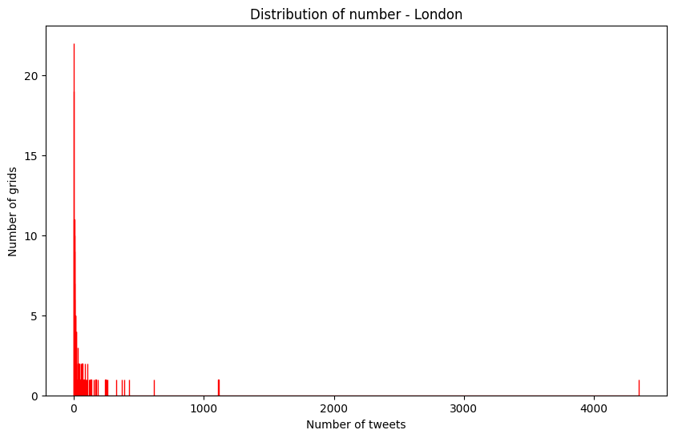
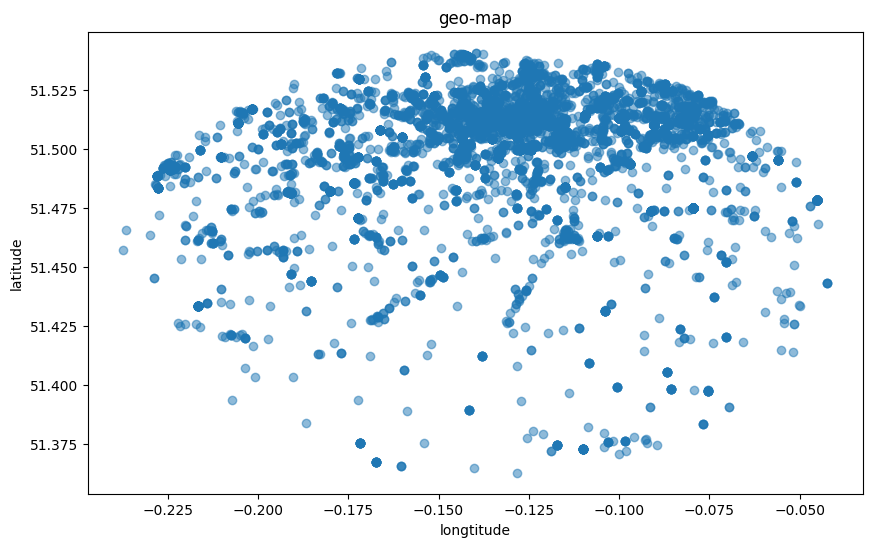
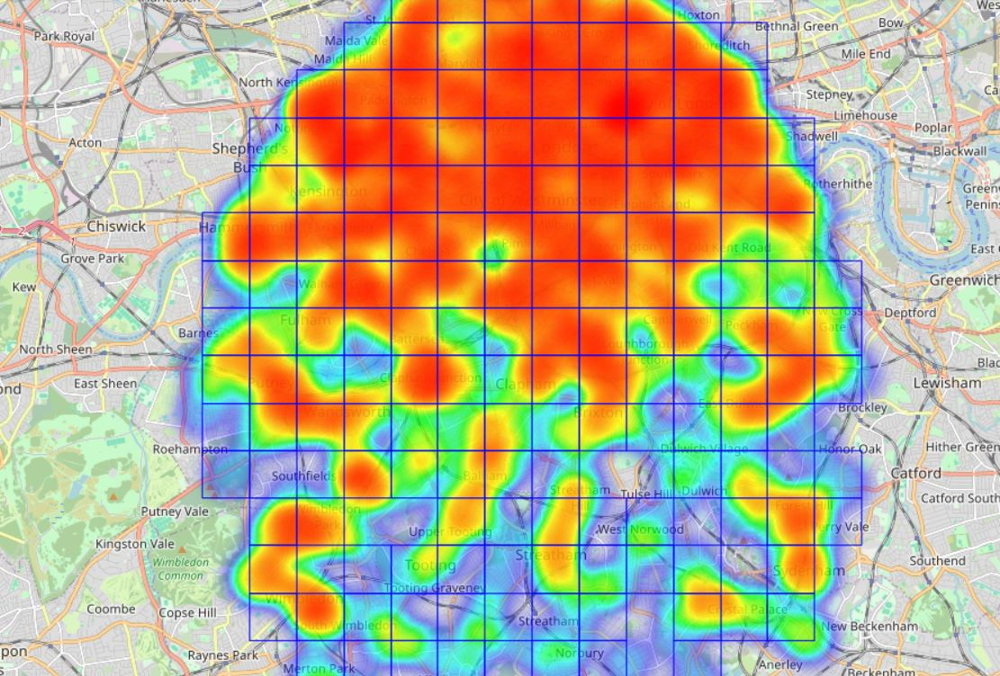
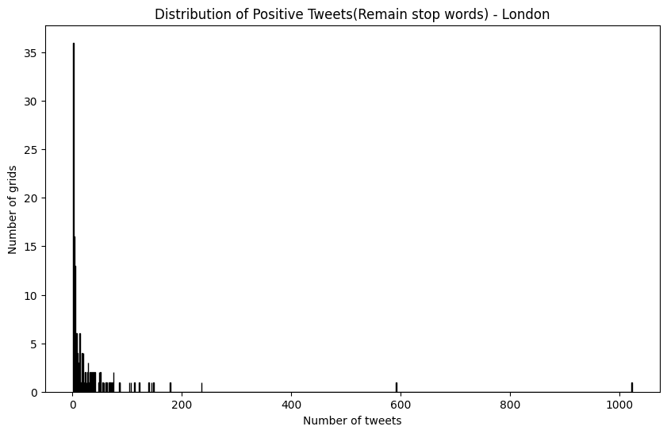
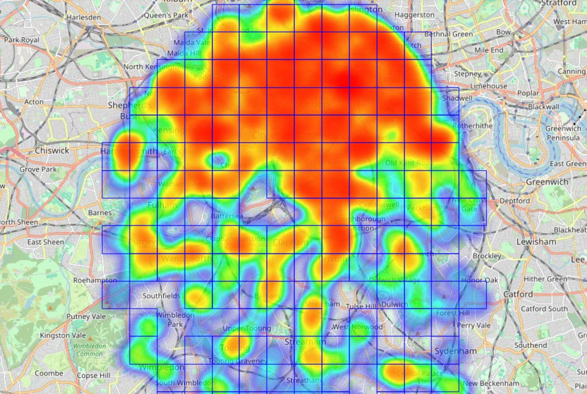
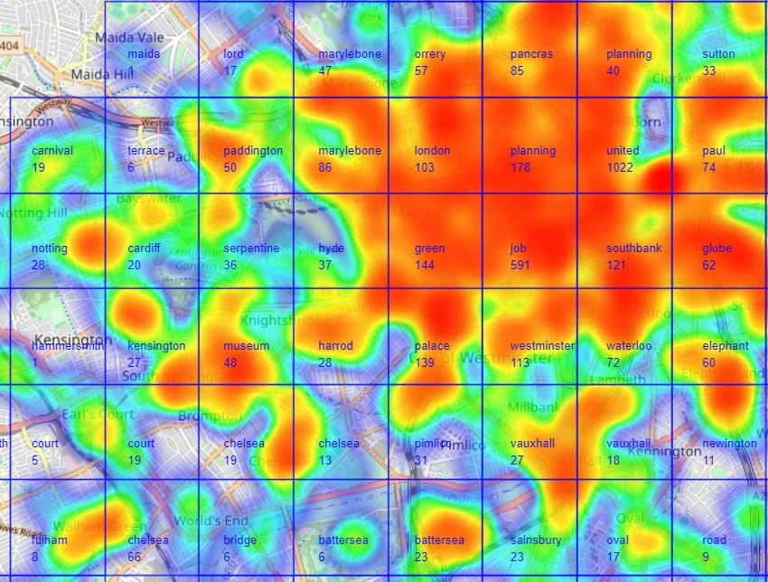

# 1. Geo Localization

The algorithm used in this study aims to extract, process, and visualize geographic location information from a large amount of tweet data. The algorithm mainly includes the following steps: data loading, text preprocessing, grid mapping creation, and data visualization. The pseudo code for overview is as follows:

```python
tweets = load_dataset()  # 1. first load from json file
tweets['cleaned_text'] = tweets['text'].apply(preprocess_text)  # 2. second do pre-processing for each test 
grid_map = create_grid_map(tweets, number of tweet)  # 3. make a map dict for each tweet  
visualize_data(grid_map)   # 4. draw useful pict for map
```

## 1.1 Dataset Overview

The following five json files give around 10-20K tweets from London(UK). Before preprocessing the dataset, first it is necessary to have a short look on data's structure. Our first task is to locate those tweets, so the `"text"`, `"location"`, `"coordinates"` are the main elements we need to consider about. 

```json
{
    "_id": 1565429028747616256,				
    "date": {
        "$date": "2022-09-01T19:58:59Z"
    },
    "screen_name": "loststoryart",
    "qualityScore": 0.5543859649122808,
    "text": "Just posted a photo @ London, United Kingdom https://t.co/WmczYM5N4H",  //main text of tweet
    "url": "https://t.co/Ejo6POjL2A",
    "description": "Artist/Dreamer",
    "listed_count": 0,
    "user_created": {
        "$date": "2014-09-06T16:58:45Z"
    },
    "geo_enabled": true,
    "favourites_count": 12,
    "coordinates": [		
        -0.1094,			//longtitude and latitude where the tweet locate
        51.5141
    ],
    "location": "London, England",
    "followers_count": 105,
    " friends_count": 105,
    "place_name": "City of London, London",
    "place_country": "United Kingdom",
    "country_code": "GB",
    "place_coordinates": [
        [
            [
                -0.112442,
                51.5068
            ],
            [
                -0.0733794,
                51.5068
            ],
            [
                -0.0733794,
                51.522161
            ],
            [
                -0.112442,
                51.522161
            ]
        ]
    ],
    "hashtags": [],
    "mentions": [],
    "source": "Instagram"
}
```

Our first task is to visualize the geographical distribution of the above tweets. 

## 1.2 Text Preprocessing

### 1.2.1 Text Cleaning

When preprocessing text, we first need to process the user's tweet text. When users post tweets, they not only have a large number of mood particles, emojis, links, tags, but even call at others, even some modal particles, mixed uppercase and lowercase, or spelling errors. So it is important to convert the text into a unified and easy to process format, which can facilitate the analysis of subsequent tasks and reduce the number of code iterations. 

Nlp package can do help in our codes, it will change our complex text into regular tokens:

```python
nlp = spacy.load("en_core_web_sm")

def preprocess_text_spacy(text):
    text = re.sub(r'https?://\S+', '', text)
    text = re.sub(r'\w+', '', text)
    text = re.sub(r'[\t\n]+', ' ', text)`#remove other useless blanks from the tweets
    doc = nlp(text)
    cleaned_tokens = []
    for token in doc:
        if not token.is_stop and not token.is_punct and token.is_alpha:  #consider the alpha to avoid emoji
            cleaned_token = token.lemma_.strip()
            cleaned_token = cleaned_token.lower()
            cleaned_token = re.sub(r'\s+', ' ', cleaned_token)
            if cleaned_token:
                cleaned_tokens.append(cleaned_token)
    return cleaned_tokens
```

### 1.2.2 Network 

Next, we need to convert the location information of the text into an operable form. Based on the geographic information of real longitude and latitude, we can transform the distribution of tweets into a grid area of 1km x 1km. Based on the approximate latitude and longitude information of the main urban area of London, the coordinates of the four boundary points of the grid are as follows:

```python
sw_corner_lat, sw_corner_lon = 51.2867602, -0.5103751
ne_corner_lat, ne_corner_lon = 51.6918741, 0.3340155
```

The calculation method of longitude and latitude distribution to kilometers varies by region, and there are subtle differences in the relationship between high and low latitudes. Of course, considering that the scope of the research is limited to the urban area of London, the differences in the conversion formula for kilometers caused by changes in longitude and latitude within it can be approximately ignored. Based on the latitude of London, the latitude difference is converted into kilometers, which is approximately 110.574. (Assuming we consider the Earth as a complete sphere.)

```python 
num_grids_lat = int((ne_corner_lat - sw_corner_lat) * 110.574)
num_grids_lon = int((ne_corner_lon - sw_corner_lon) * 111.320 * math.cos(math.radians(sw_corner_lat)))

grid_map = {}
for tweet in dict:
    if 'coordinates' in tweet and tweet['coordinates']:
        lon, lat = tweet['coordinates']
        grid_x = int((lon - sw_corner_lon) * 111.320 * math.cos(math.radians(sw_corner_lat)))
        grid_y = int((lat - sw_corner_lat) * 110.574)
        if (grid_x, grid_y) not in grid_map:
            grid_map[(grid_x, grid_y)] = []
        grid_map[(grid_x, grid_y)].append(tweet['_id'])
```

In this way, we now get a grid mapping dictionary that maps a value related to the tweet ID using coordinate points as keys. 

```python
netID: (27, 25), TweetID: [1565429028747616256, 1565428982660603907......]
```

Now we can get some useful statistics data from the dataset. 

- **The total number of the tweets:** 13192
- **The number the grids we divide**: 193

## 1.3 Results

### 1.3.1 Bar Chart

Based on the horizontal axis representing the total number of tweets and the vertical axis representing the number of tweet grids, we can observe the distribution of tweets in the form of a bar chart. The code is shown below:

```python
tweets_per_grid = [len(tweet_ids) for tweet_ids in grid_map.values()]
plt.figure(figsize=(10, 6))
plt.hist(tweets_per_grid, bins=range(1, max(tweets_per_grid)+1), color='blue', edgecolor='red')
plt.title('Distribution of number - London')
plt.xlabel('Number of tweets')
plt.ylabel('Number of grids')
plt.show()
```



If we assume that tweets are evenly distributed, the average number of tweets per grid is approximately 68, but this is clearly impossible. In fact, the proportion of cells below 68 reaches 83%. A small portion of the tweet grid occupies the vast majority of the tweet data, with the highest grid even occupying over 4000 pieces of information. The remaining tweets are distributed very sparsely, with only a few dozen tweets per grid, and such grids occupy the majority. This distribution indicates that although the vast majority of tweets are concentrated in a few hot areas, there are also a large number of grids with almost no tweet activity, reflecting an extremely uneven geographical distribution of tweet activity.

We can try another plot point map to visualize this distribution. 



Almost all tweets are concentrated in the northeast region, and according to the map, this area is also the location of popular scenic spots such as London Bridge and Tower of London, which can partly explain why most tweets are posted in this area.

### 1.3.2 Heat Map

The second option for visual analysis is the heat map, which displays the geographic regions of the grid in a specially highlighted form, allowing for a more intuitive view of the tweet density in different regions.

```python
grid_size_x = max(x for x, y in grid_map.keys()) + 1
grid_size_y = max(y for x, y in grid_map.keys()) + 1
grid_array = np.zeros((grid_size_y, grid_size_x))

for (x, y), tweet_ids in grid_map.items():
    if 10 <= x <= 40 and 5 <= y <= 35:
        grid_array[y, x] = len(tweet_ids)

grid_array = np.log1p(grid_array)

plt.figure(figsize=(14, 7))
plt.imshow(grid_array[5:36, 10:41], cmap='hot', interpolation='nearest')
plt.colorbar(label='Number of tweets per grid (log scale)')
plt.title('Heatmap of number of tweets per grid')
plt.xlabel('Grid X Coordinate')
plt.ylabel('Grid Y Coordinate')
plt.show()

```

According to our previous bar distribution chart, some grids have data that far exceeds others. If applied directly, the distribution of the heat map will only become a few scattered points. Therefore, in this step, we logarithmically processed the number of tweets in the code `grid_array = np.log1p(grid_array)`, which can make the data relatively smooth and achieve the best results. The figure is as follows:


### 1.3.3 Other useful Map

We can also render the heat map on a real map. To verify whether the distribution of tweets matches some important landmarks (such as scenic spots, commercial areas, sports fields, etc.)

```python
m = folium.Map(location=map_center, zoom_start=6)
```



In terms of satellite imagery, tweets are unevenly distributed north and south, concentrated in most parts of the north and south banks of the Thames (such as Camperwell and Lambeth), with City of London being the most densely populated. Other residential areas such as the University District, White Chapel, Chelsea, and Fulham are also scattered.

### 1.3.4 Conclusion

Finally, list the percentage of tweet grids smaller than a certain value in the total grid in the form of a table.

| <10  | <20  | <30  | <40  | <50  | <60  | >100 | >125 | >150 | >200 |
| ---- | ---- | ---- | ---- | ---- | ---- | ---- | ---- | ---- | ---- |
| 47%  | 62%  | 67%  | 73%  | 78%  | 80%  | 11%  | 9%   | 7%   | 5%   |

Grids with counts below 60 account for nearly 80%, while those below 10 comprise less than 50%. But for 5% of grid has more than 200 grids. This distribution may indicate that only a few areas are hot spots on social media, and these areas may be areas with high foot traffic, such as commercial centers, tourist attractions, or transportation hubs.

Through visual analysis of the geographical distribution of tweets in the London area, we observed that tweeting activities are mainly concentrated in the central areas of the city, especially near famous tourist attractions and commercial areas. This distribution pattern may reflect the activity patterns of social media users in public spaces, where people tend to post tweets in densely populated or socially active areas. However, this also exposes a potential problem of geolocation technology in analyzing urban social media data: for areas where social media usage is not active enough or geographic location information is missing, it may be misunderstood as a "dead zone" for social activities. This situation reminds us that when using geolocation technology to analyze social media data, we need to consider the bias and limitations of the data, as well as their impact on the interpretation of research results.

<div style="page-break-after: always;"></div>

# 2. Newsworthiness Model

The second part we are focusing on Newsworthiness evaluation. As for the tweets, the various types of them on the Internet are numerous and varied, but most of them are worthless, like meaningless ads, meaningless screen swiping and low-quality marketing accounts. 

The evaluation of news value is influenced by a combination of various factors, such as attention, likes, social influence, etc. Here, we only measure news value from the perspective of text, and we will apply the results to the impact of geographical distribution in the previous text.

## 2.1 Dataset Overview

The following dataset contains three json files: bgQuality, highQuality and lowQuality. The bgQuality contains background tokens from the rest of two files, and with a score of each one, which integrates the distribution of low-quality and high-quality tweets. It formats is as shown:

```json
[{"_id":"1613006911946776576",
  "text":	["confidence","dont","fix","lost","need","negative","playing","right","support","well"],
  "score":0.6367300158372926},
....]
```

The following two documents contain datasets of high-quality and low-quality models, which have been preliminarily screened and only contain the original tweet and an evaluation score. This score is calculated by combining other parameters of the tweet (attention, user background, authentication, etc.). The tweet format for both is as follows:

```json
{"_id":
{"$oid":"623cb1491fdfc2cfea3b85c4"},
 "username":"miguel_zavalaa",
 "description":"•Mind with no sense in it•   •Stay away from me ‘cause I’m dancing to quite a different drumbeat•",
 "qualityS":0.6081996434937612,
 "text":"Turisteando (@ Piccadilly Circus in London, Greater London) https://t.co/ear25pmZNc https://t.co/528VOdxIeF"}...
```

The number of elements of each json file is:

- **High quality tweets**: 2501
- **Low quality tweets:** 1527 
- **Background tweets**: 2239

## 2.2 Score Algorithm

First we should reuse the function in subtitle **1.2.1** `preprocess_text_spacy`, but in this time we can remove the `is_stop` function as the second function. 

```python
if not token.is_punct and token.is_alpha:
```

Term Frequency-Inverse Document Frequency (TF-IDF) is a common weighting technique used in information retrieval and text mining. TF-IDF is a statistical measure that evaluates the importance of a word to a document in a collection or corpus. The calculation is based on the product of two metrics: term frequency (TF) and inverse document frequency (IDF). Compared to methods that only consider term frequency (TF), TF-IDF also accounts for the rarity of the word across documents, impacting its importance. In terms of our news evaluation method, the appearance of specific keywords may have higher news value, so we choose TF-IDF as the word frequency. In that way, we can draw function like that:

```python
def compute_tf_idf(word_list, corpus):
    tf = Counter(word_list)
    df = Counter()
    for doc in corpus:
        df.update(set(doc))
    total_docs = len(corpus)
    idf = {word: math.log((total_docs + 1) / (freq + 1)) + 1 for word, freq in df.items()}
    tf_idf = {word: (freq * idf.get(word,0)) for word, freq in tf.items()}
    return tf_idf
```
After getting each tf-idf value from each dictionaries, then we need to design for t-value of each word, then compare each word with a high or a low model, so we can classify a word whether it is a high-quality word or a low-quality word:

1. Calculate the TF of test words in high-quality, low-quality, and background text sets.

2. Calculate the total word frequency of the entire high-quality text set, low-quality text set, and background text set.

3. Calculate the relative frequency (R) of test words in high-quality and low-quality text sets separately, by dividing the frequency of test words by the total frequency, and then dividing by the ratio of the frequency of test words in the background text set to the total frequency of the background text set.
   $$
   R_{HQ_t} = \frac{\frac{tf_{t\_HQ}}{FHQ}}{\frac{tf_{t\_BG}}{FBG}},  R_{LQ_t} = \frac{\frac{tf_{t\_LQ}}{FLQ}}{\frac{tf_{t\_BG}}{FBG}}
   $$
   
4. If the calculated relative frequency is greater than 2, keep the value; otherwise, set it to 0.
   $$
   S_{HQ_t} = \begin{cases} 
     R_{HQ_t} & \text{if } R_{HQ_t} > 2 \\
     0 & \text{otherwise}
     \end{cases}
   $$

   $$
   S_{HQ_t} = \begin{cases} 
     R_{HQ_t} & \text{if } R_{HQ_t} > 2 \\
     0 & \text{otherwise}
     \end{cases}
   $$

   

5. Return the score (S) of test words in both high-quality and low-quality text sets.

The related codes are as follows:

```python
def get_R(test_word, hq_dict, lq_dict, bg_dict):
    tf_t_HQ = hq_dict.get(test_word, 0)
    tf_t_LQ = lq_dict.get(test_word, 0)
    tf_t_BG = bg_dict.get(test_word, 1)
    
    FHQ = my_sum(hq_dict.values())
    FLQ = my_sum(lq_dict.values())
    FBG = my_sum(bg_dict.values())
    
    R_HQ_t = (tf_t_HQ / FHQ) / (tf_t_BG / FBG) if FHQ and FBG else 0
    R_LQ_t = (tf_t_LQ / FLQ) / (tf_t_BG / FBG) if FLQ and FBG else 0
    
    S_HQ_t = R_HQ_t if R_HQ_t > 2 else 0
    S_LQ_t = R_LQ_t if R_LQ_t > 2 else 0
    
    return S_HQ_t, S_LQ_t
```
Finally, accumulate the high-quality score `SQHt` and low-quality score `SQLt` for each term, and then apply a logarithmic function to measure the ratio of these two cumulative values (while adding one to each value to avoid division by 0 errors) to obtain the news value score `Nd` for the document.
$$
sum\_SQHt = \sum_{term \in terms} SQHt(term),  sum\_SQLt = \sum_{term \in terms} SQLt(term)
$$

$$
Nd = \log_2 \left(\frac{1 + sum\_SQHt}{1 + sum\_SQLt}\right)
$$


```python
def calculate_newsworthiness_score(document):
  terms = document
  sum_SQHt = 0
  sum_SQLt = 0
  for term in terms:
    SQHt, SQLt = get_R(term, hq_dict, lq_dict, bg_dict)
    sum_SQHt += SQHt
    sum_SQLt += SQLt
  Nd = np.log2((1 + sum_SQHt) / (1 + sum_SQLt))
  return Nd
```

## 2.3 Threshold & Analysis 

We defined the existing functions in two forms based on the scoring rules: removing stop words and retaining stop words. We tested the subjectively perceived high-quality and low-quality texts in Task 1, and the results are as follows:

| Typical Text                                                 | Without Stop Words  | With Stop Words     |
| ------------------------------------------------------------ | ------------------- | ------------------- |
| Just posted a photo @ Eliza Jane Howell https://t.co/wuge0a1q4C | -3.0325245128076674 | -3.020020733961346  |
| A501 west of Park Square East https://t.co/bnEiGwEguS        | -1.7506014589723562 | -1.7411171016817764 |
| Wall on Brick Lane #StreetArt #BrickLane #EastLondon @ Brick Lane - Shoreditch https://t.co/ECDZHBFDWR | 4.361730176100542   | 4.3572019041437136  |
| Programme reveal of LFF 2022 (at @BFI Southbank in London, Greater London) https://t.co/B5hvyyA09R | -1.750772911872734  | -1.741262916532665  |
| This #Retail job might be a great fit for you. Click the link in our bio to see it and more. Shift Supervisor - Store# 12202, LEADENHALL STREET EC at Starbucks | 0.4589061026253425  | 1.1259095851671883  |

Also we count for the number of items whether using stop words of not. 

| Count              | Without Stop Words | With Stop Words |
| ------------------ | ------------------ | --------------- |
| count for positive | 1795               | 1952            |
| count for zero     | 52                 | 39              |
| count for negative | 11345              | 11201           |

The vast majority of low-quality tweets are mainly based on simple images, with almost no textual information. Removing stop words does not make a significant difference in the basic judgment of high-quality tweets. Stop words make the final rating curve smoother, and most absolute values tend to decrease (except for some logically rigorous stop word tweets). However, overall, retaining stop words is more effective.

The simplest threshold principle was to distinguish positive and negative values based on 0 as the boundary. Setting 0 as a threshold means that any positive R value indicates a higher frequency of terms appearing in a high-quality set relative to the background set, which simplifies the decision-making process. As long as the R value is greater than 0, this term is considered as part of the news value score. By not artificially excluding any terms, you preserve the integrity of the data, and such statistical analysis may better reflect the news value of the text content. A lower threshold (such as 0) is easier to explain to non professionals, as it essentially means that as long as the term appears more frequently in high-quality text than in background text, it has news value.

At the same time, we consider that the algorithm has made trade-offs between positive values of 2 and below, which should belong to low-quality tweets that are not obvious. Depending on the standards, these tweets may exhibit opposite trends in different backgrounds. So the threshold right now is **0** and **-2**. But in reality, this number should be an exact number between -2 and 0. Right now, parts exceeding 0 are considered high-quality tweets, content between -2 and 0 is considered conditionally low-quality tweets, and content below -2 is considered low-quality tweets

However, considering that we use TF-IDF as the frequency, our true threshold may require a corresponding offset, so the actual threshold should be more than one.

<div style="page-break-after: always;"></div>

# 3. Application

## 3.1 Threshold Reconfirm

Next, we will apply the function to our geographic tweet by retaining stop words, thereby preserving the relevant logic of the tweet. Before obtaining the classification results, first draw the final score of the target tweet. We have detailed the distribution within the range of -4 to 0, then comes to the graph:


Within the potential low-quality images, except for the parts with a score of approximately -3 to -4 that have been verified to be tweets with only uploaded images and no valid textual information, the range between -2 and 0 is relatively blurry and difficult to define as low-quality tweets in a sense. And there is peak information at around -1.6, so we will refer to the tweets in the -1.6 section. Some tweets near -1.6 goes like:

- \#trinisinlondon #trinisinlondonphotography @ London, United Kingdom https://t.co/xd6993MkYR
- Drinking a Luxury Fries by Mikkeller Brewpub London at @mikkellerbeer — https://t.co/Ps52aaZasd
- Arrival! @ London, United Kingdom https://t.co/fMIKvlfoXB
- ‘I’m stockpiling energy.’ ! Great idea @ London, United Kingdom https://t.co/4AUQQnvE7Z

But tweets near -1.5 goes like:

- Pop in today and see our large collection of mid century furniture! @ Vintique London https://t.co/CczudNj3V3
- London, England - Me and my friend (both having had the truffle pasta) at this location super ill afterwards.

- 2 years I’ve waited to go and visit the Disney reef at work and finally today I noticed it has opened back up  #disneyfan #gosh https://t.co/n5v3upPQ7t
- Lovely morning run in regents park and even made it to the home of cricket #london #running #regentspark #lordscricketground @ Regents Park, Under a Tree https://t.co/hWXNsERidO

The vast majority of information may be important to the followers of the tweeter, but such information may not be globally relevant, so we classify it as low-quality. In this case, a threshold of **-1.6** almost blocks most low-quality tweets. The precision of the algorithm, especially in filtering out low-quality tweets, demonstrates its potential as a tool for enhancing the signal-to-noise ratio in social media analytics.

## 3.2 Geographical Information Application

Based on the new threshold, we can obtain the distribution of tweets, **7751** for low quality and **5441** for high quality. Firstly, we need to eliminate the low-quality parts. 

```python
target_grid_map = grid_map_positive if tweet['final'] >= threshode else grid_map_negative
```

First we can get the bar chart from our positive map :



It can be seen that the basic and pre-removal distributions are roughly similar, indicating that high and low quality tweets are roughly evenly distributed within the grid. We can verify this using a heat map.


In terms of longitude and latitude, the point distribution map is as follows:


In this section of the report, we delve deeper into the application of geographical information, specifically reflecting on the comparative analysis between tweet distributions discussed in part one. Employing the reconfirmed threshold to sift through the tweet quality, we segregated 7,751 low-quality tweets from 5,441 high-quality tweets. This filtering process led to an enlightening observation: high and low-quality tweets are fairly evenly distributed within the grid, as depicted in the heat maps and bar charts. This insight is in line with the initial tweet distributions presented in the first part of our study, affirming the efficacy of our algorithm in the realm of geographical information application.

<div style="page-break-after: always;"></div>

# 4. Open Task Discovery

For the geographical distribution map, when considering the comprehensive news value and geographical distribution, obtaining the hot vocabulary of each tweet can to some extent obtain the general information and summary of tweets near the grid. Subsequently, by analyzing these high-frequency words, it is possible to predict and analyze the hot topics of a tweet in a certain location. Considering that we previously analyzed the frequency of high and low-quality tweets using TF-IDF documents, we are now incorporating them into the filtered geographic distribution map.

```python
idf_values = {word: math.log((total_docs + 1) / (freq + 1)) + 1 for word, freq in doc_freq.items()}
tf_idf_values = {}
for grid, tfs in tf_values.items():
    grid_tf_idf = []
    for tf in tfs:
        tf_idf = {word: (tf[word] * idf_values[word]) for word in tf}
        grid_tf_idf.append(tf_idf)
    tf_idf_values[grid] = grid_tf_idf
```

Based on the first part, we have mapped the distribution of the real area of London and obtained the satellite map as follows, which is basically consistent with the original distribution, confirming the validation of our third part.



By sorting the tweets within the grid in TF-IDF, we can roughly obtain the word with the highest weight within each grid, which to some extent also indicates the tendency of user topics within that grid. This analysis, albeit preliminary, provides a glimpse into the topical inclinations of users within those grids, potentially paving the way for predictive analyses of trending topics at specific locations. Due to space constraints, we have cataloged the top five trending topics within some selected typical tweet grids, offering a snapshot of the prevalent discourse in these micro-locations.

| Grid    | TOP 1      | TOP 2       | TOP 3      | TOP 4         | TOP 5                | Real-world Nearby Description       |
| ------- | ---------- | ----------- | ---------- | ------------- | -------------------- | ----------------------------------- |
| (28,15) | otter      | trading     | vegan      | gift          | new                  | On Wolfington Road                  |
| (25,24) | green      | park        | row        | savile        | london               | Green Park & Wimbourse House Nearby |
| (22,21) | chelsea    | chelseafc   | stamford   | brigde        | love                 | Chelsea FC locate                   |
| (27,25) | united     | kingdom     | london     | queen         | elizabeth            | Lincolnls Inn Fields                |
| (23,25) | paddington | london      | station    | greater       | railway              | London Paddington Station           |
| (27,26) | planning   | application | register   | new           | gray                 | London Central Mail Center          |
| (28,25) | paul       | cathedral   | farringdon | barbican      | job                  | St's Paul Cathedral                 |
| (28,26) | sutton     | arms        | lane       | drinking      | brick                | King Square Gardens                 |
| (30,20) | united     | kingdom     | london     | photooftheday | bdexentertainmentnew | Peckham                             |
| (26,24) | job        | england     | london     | bio           | link                 | London charing cross                |

The basic internet grid hot vocabulary has a high similarity to the nearby geographical situation. Topics such as train stations, church scenic spots, and Stamford Bridge Stadium are mainly related, which can to some extent reflect the relevance of topics within the grid area.

Hot topics and the number of tweets are labeled on the graph, for clarity, only a portion of West London is shown here. It will be as follows:

